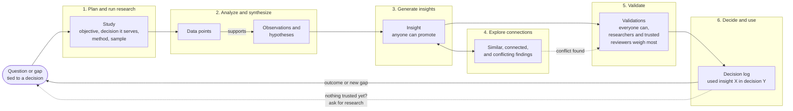
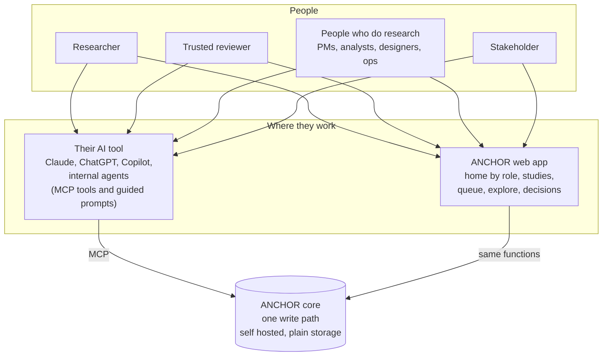
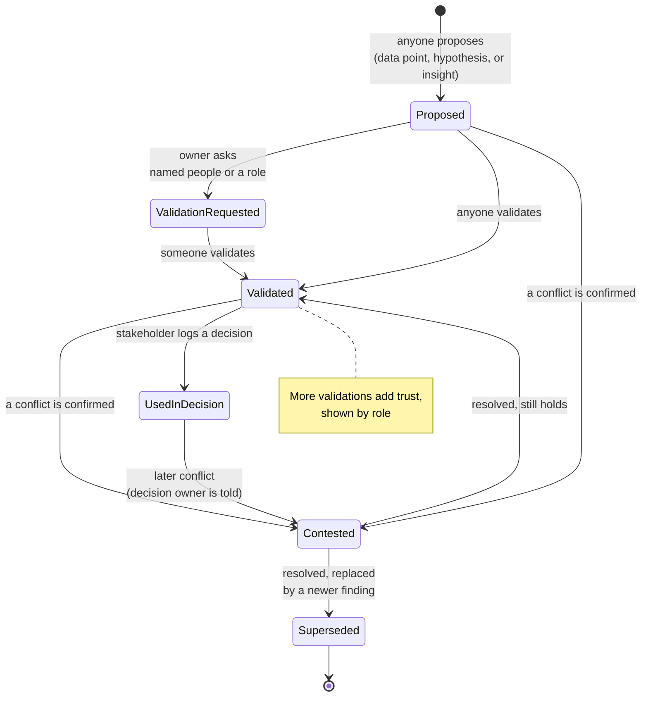
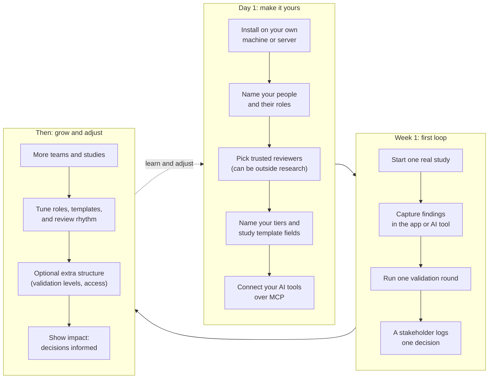

# How ANCHOR works: the full loop

This page shows how research moves through ANCHOR, who does what, and how a team sets it up. It covers what exists today and what is planned. The backlog lives in [GitHub issues](https://github.com/mitchh14/amped-insights/issues), grouped by the labels `now`, `next`, and `later`.

Two ideas shape everything below:

- **Everyone generates insights.** That is the intended state, not a side effect. Researchers, people who do research, and AI agents working for them all turn what they see into insights.
- **Validation is open, with varied trust.** Anyone can validate. Researchers and trusted reviewers (people the team gives that standing, inside or outside research) carry the most weight. Roles inform, they never block.

See [PRINCIPLES.md](../PRINCIPLES.md) for the why.

## 1. The full loop

Research starts with a question tied to a decision, moves through analysis, insights, connections, and validation, and ends with a decision. Decisions and gaps raise new questions, which start the next round.

| Mode | Main user | Today | Next |
|---|---|---|---|
| 0. Set up | Research lead or team | `anchor.toml`, identity and roles, [SETUP.md](SETUP.md) | Guided first run [#38](https://github.com/mitchh14/amped-insights/issues/38) |
| 1. Plan and run research | Researcher, people who do research | Studies with objective, decision, method, sample, team fields | [#6](https://github.com/mitchh14/amped-insights/issues/6) |
| 2. Analyze and synthesize | Researcher, people who do research | `propose` into a study with evidence links | Evidence quality [#27](https://github.com/mitchh14/amped-insights/issues/27) |
| 3. Generate insights | Everyone, on purpose | `promote` to a new linked finding, with an optional team rule | [#8](https://github.com/mitchh14/amped-insights/issues/8) |
| 4. Explore connections | Everyone | Typed links, conflict check, Explore view | Explore view [#30](https://github.com/mitchh14/amped-insights/issues/30) |
| 5. Validate | Everyone can; researchers and trusted reviewers weigh most | Review requests, outcomes, how I checked, trust by role, revise | Conflict resolution [#31](https://github.com/mitchh14/amped-insights/issues/31) |
| 6. Decide and use | Stakeholder | Decision log with chain credit and at risk flags | Impact dashboard [#44](https://github.com/mitchh14/amped-insights/issues/44) |
| Loop back | All | Research requests land as draft studies | |

## 2. Who does what, and where

Every person can work in the app, in their own AI tool over MCP, or both. The AI tool is the everyday companion. The app is the shared status board and a full place to work for anyone who prefers it. Both write through the same core, so there is only one version of the truth.

| Step | Researcher | People who do research | Trusted reviewer | Stakeholder | AI agent |
|---|---|---|---|---|---|
| Plan a study | Leads | Often | | Asks for it | Helps draft |
| Capture data and hypotheses | Yes | Yes | | | Drafts, marked as AI assisted |
| Generate insights | Yes | Yes | Yes | Yes | Drafts for a person to own |
| Explore connections | Yes | Yes | Yes | Yes | Yes |
| Validate | Yes, most weight | Yes, shown as peer | Yes, most weight | Yes, shown by role | Never validates on its own |
| Log a decision | | | | Leads | Helps record |
| Ask for new research | Yes | Yes | Yes | Leads | Suggests when nothing trusted exists |

Related backlog: app shell [#24](https://github.com/mitchh14/amped-insights/issues/24), MCP parity [#25](https://github.com/mitchh14/amped-insights/issues/25), guided MCP prompts [#26](https://github.com/mitchh14/amped-insights/issues/26), remote MCP for enterprise AI tools [#35](https://github.com/mitchh14/amped-insights/issues/35).

## 3. The life of a finding

A finding keeps its full history. Nothing is erased. Status changes are logged, and prior states stay visible.

Anyone can promote a data point to a hypothesis, or a hypothesis to an insight. Promotion creates a new finding linked back to the original, which stays as it was, so the chain from evidence to insight stays readable. A team can set a "ready to promote" rule in `anchor.toml`. Reviews can approve, ask for changes, or disagree, and when changes are asked for, the owner revises into a new, linked version. The trust shown on a finding comes from who validated it, in what role, and how they checked, for example "Validated by 2 researcher, 1 peer. How they checked: checked the source data (2)."

| State | Today | Planned |
|---|---|---|
| Proposed, Validated, Contested | Yes | |
| Validation requested | Yes, shown as open review requests on the finding | |
| Resolved and Superseded | Not yet. Revising creates a newer, linked version | [#31](https://github.com/mitchh14/amped-insights/issues/31) |
| Used in decision | Yes, and the decision owner sees if it is later contested | |

## 4. Setting it up: a framework powered by your team

ANCHOR does not come with one fixed process. The team that implements it decides how it fits their way of working. Defaults are open, and each team adds only the structure it wants.

| What the team decides | Where | Backlog |
|---|---|---|
| People, roles, trusted reviewers | `anchor.toml` | [#14](https://github.com/mitchh14/amped-insights/issues/14), [#15](https://github.com/mitchh14/amped-insights/issues/15) |
| Tier names, study template, which steps to show | `anchor.toml` | [#15](https://github.com/mitchh14/amped-insights/issues/15) |
| Promotion rules, and whether they are a signal or required | `anchor.toml` | [#18](https://github.com/mitchh14/amped-insights/issues/18) |
| How to install and connect AI tools | [`docs/SETUP.md`](SETUP.md) | [#16](https://github.com/mitchh14/amped-insights/issues/16) |
| Guided first run in the app | Web app | [#38](https://github.com/mitchh14/amped-insights/issues/38) |
| Optional validation levels | `anchor.toml`, off by default | [#37](https://github.com/mitchh14/amped-insights/issues/37) |
| Optional access controls and SSO | Admin, off by default | [#39](https://github.com/mitchh14/amped-insights/issues/39) |

## Backlog at a glance

The live roadmap with checkboxes is [#47](https://github.com/mitchh14/amped-insights/issues/47).

**Now: close the loop end to end.** Identity and roles [#14](https://github.com/mitchh14/amped-insights/issues/14), config file [#15](https://github.com/mitchh14/amped-insights/issues/15), setup guide [#16](https://github.com/mitchh14/amped-insights/issues/16), studies [#17](https://github.com/mitchh14/amped-insights/issues/17), promote [#18](https://github.com/mitchh14/amped-insights/issues/18), typed links [#19](https://github.com/mitchh14/amped-insights/issues/19), request validation [#20](https://github.com/mitchh14/amped-insights/issues/20), validation trust by role [#21](https://github.com/mitchh14/amped-insights/issues/21), decision log [#22](https://github.com/mitchh14/amped-insights/issues/22), research requests [#23](https://github.com/mitchh14/amped-insights/issues/23), app shell [#24](https://github.com/mitchh14/amped-insights/issues/24), MCP parity [#25](https://github.com/mitchh14/amped-insights/issues/25), guided prompts [#26](https://github.com/mitchh14/amped-insights/issues/26).

**Next: depth and quality.** Evidence quality [#27](https://github.com/mitchh14/amped-insights/issues/27), sources [#28](https://github.com/mitchh14/amped-insights/issues/28), AI assisted synthesis [#29](https://github.com/mitchh14/amped-insights/issues/29), explore view [#30](https://github.com/mitchh14/amped-insights/issues/30), conflict resolution [#31](https://github.com/mitchh14/amped-insights/issues/31), validation outcomes [#32](https://github.com/mitchh14/amped-insights/issues/32), insight library [#33](https://github.com/mitchh14/amped-insights/issues/33), staleness [#34](https://github.com/mitchh14/amped-insights/issues/34), remote MCP [#35](https://github.com/mitchh14/amped-insights/issues/35), notifications [#36](https://github.com/mitchh14/amped-insights/issues/36), validation levels (discovery first) [#37](https://github.com/mitchh14/amped-insights/issues/37), guided first run [#38](https://github.com/mitchh14/amped-insights/issues/38).

**Later: scale.** SSO and access [#39](https://github.com/mitchh14/amped-insights/issues/39), Postgres [#40](https://github.com/mitchh14/amped-insights/issues/40), export and import [#41](https://github.com/mitchh14/amped-insights/issues/41), integrations [#42](https://github.com/mitchh14/amped-insights/issues/42), local embeddings [#43](https://github.com/mitchh14/amped-insights/issues/43), impact dashboard [#44](https://github.com/mitchh14/amped-insights/issues/44), workspaces [#45](https://github.com/mitchh14/amped-insights/issues/45), demo refresh [#46](https://github.com/mitchh14/amped-insights/issues/46).
