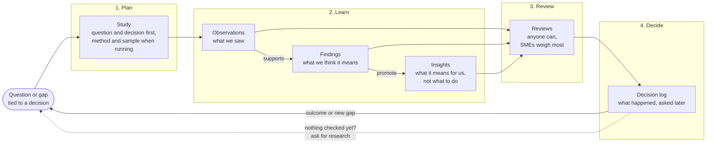
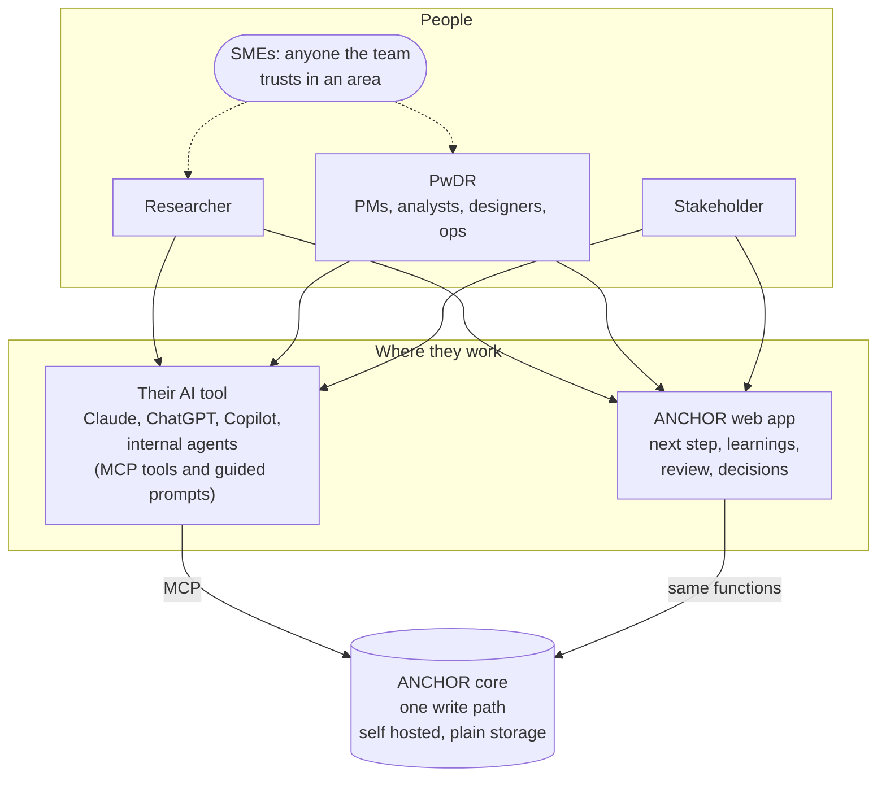
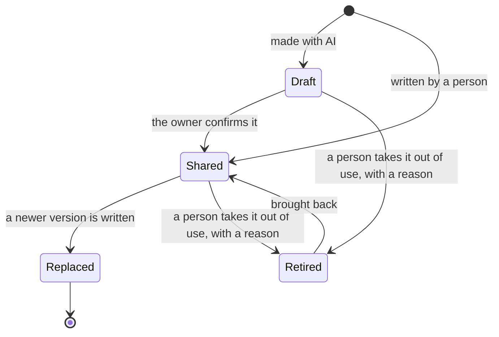
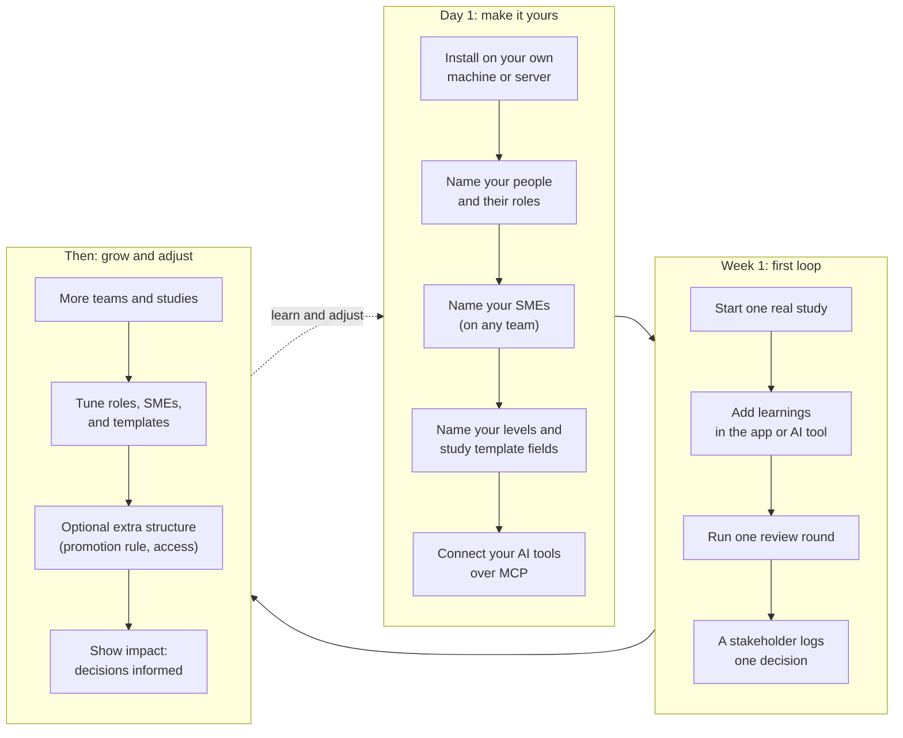

# How ANCHOR works: the full loop

This page shows how research moves through ANCHOR, who does what, and how a team sets it up. The words are defined in [GLOSSARY.md](GLOSSARY.md). The backlog lives in [GitHub issues](https://github.com/mitchh14/amped-insights/issues), with the live roadmap in [#47](https://github.com/mitchh14/amped-insights/issues/47).

**Current focus.** The app today is the workbench: the Plan, Learn, and Review parts of this loop. A plan breaks the question into sub-questions, blocks are built up from a base of context and checked one by one, and each sub-question shows what other workspaces already know. See [EXPERIENCE.md](EXPERIENCE.md). Plan, Decide, and Loop back below are the wider vision. The core supports them, and the app shows them as coming later.

Two ideas shape everything below:

- **Everyone generates insights.** That is the intended state, not a side effect. Researchers, PwDR, and the AI tools they work with all turn what they see into learnings.
- **Review is open, with varied trust.** Anyone can review. SMEs, the people a team trusts in an area, on any team, carry the most weight. Roles inform, they never block.

See [PRINCIPLES.md](../PRINCIPLES.md) for the why.

## 1. The full loop

Research starts with a question tied to a decision, moves through learnings, connections, and review, and ends with a decision. Decisions and gaps raise new questions, which start the next round.

| Mode | Main user | What happens |
|---|---|---|
| Home | Everyone | One next step, what changed for you, and moments when your work mattered |
| Plan | Researcher, PwDR | Start a workspace with its question and decision, then break it into sub-questions; see what is already known |
| Learn | Everyone | Add observations, findings, and insights, alone or with AI; promote one level up |
| Review | Everyone; SMEs weigh most | Confirm your AI drafts, ask for review, approve, ask for changes, or disagree, and revise |
| Decide | Stakeholder | Log a decision and what it relied on; say what happened later |
| Loop back | Everyone | Ask for research from a decision or an empty search |

## 2. Who does what, and where

Every person can work in the app, in their own AI tool over MCP, or both. The AI tool is the everyday companion. The app shows the one next step and is a full place to work. Both write through the same core, so there is one version of the truth.

| Step | Researcher | PwDR | Stakeholder | AI tool |
|---|---|---|---|---|
| Plan a study | Leads | Often | Asks for it | Helps draft |
| Add learnings | Yes | Yes | Yes | Drafts, marked as made with AI |
| Confirm an AI draft | Owner does | Owner does | Owner does | Never on its own |
| Review | Yes | Yes | Yes | Never on its own |
| Log a decision | | | Leads | Helps record |
| Ask for new research | Yes | Yes | Leads | Suggests when nothing checked exists |

Anyone can be an SME, whatever their role. Their approvals show as Checked by an SME.

## 3. The life of a learning

A learning keeps its full history. Nothing is erased.

Its **stage** says where it is in its life:

Retired is how anything is cleared out. It is never a delete: a retired learning keeps its history, leaves the live work, and can be brought back. What was built on it shows that it rests on a retired learning, or moves onto what replaced it.

Its **trust** says how far to lean on it, and is worked out from reviews and conflicts. One state shows at a time. When more than one could apply, the first match wins:

| Trust | When |
|---|---|
| Contested | A person confirmed a conflict with another learning that nobody has settled yet, or a current review disagrees |
| Needs changes | A current review asks for changes |
| Checked by an SME | At least one SME approves |
| Checked by peers | At least one person approves, and no SME yet |
| Not reviewed | Nobody but the owner has checked it |

Anyone can promote an observation to a finding, or a finding to an insight. Promotion adds a new learning linked back to the original, which stays as it was, so the chain from evidence to insight stays readable. A team can set a "ready to promote" rule in `anchor.toml`. When a reviewer asks for changes, the owner revises into a new, linked version, and the reviewer is asked to look again.

Anyone who owns, reviewed, used, or follows a learning hears when it is revised, promoted, newly checked, or contested. A decision that relied on something now contested becomes its maker's next step. The same goes for one that relied on something now retired.

A conflict is settled by a person, with a reason, in one of four ways: one holds (the other is retired), both hold in their own scope (each gets a new version), not a conflict, or can't tell yet (an open sub-question goes into the plan and both stay contested). See [GLOSSARY.md](GLOSSARY.md#conflicts).

## 4. Setting it up: a framework powered by your team

ANCHOR does not come with one fixed process. The team that implements it decides how it fits their way of working. Defaults are open, and each team adds only the structure it wants.

| What the team decides | Where |
|---|---|
| People, roles, and SMEs | `anchor.toml`, or from a person's page in the app |
| Level names, "how I checked" choices, study template and when each field is asked | `anchor.toml` |
| Promotion rule, and whether it is a signal or required | `anchor.toml` |
| Moments, and when to ask what happened after a decision | `anchor.toml` |
| How to install and connect AI tools | [SETUP.md](SETUP.md) |
